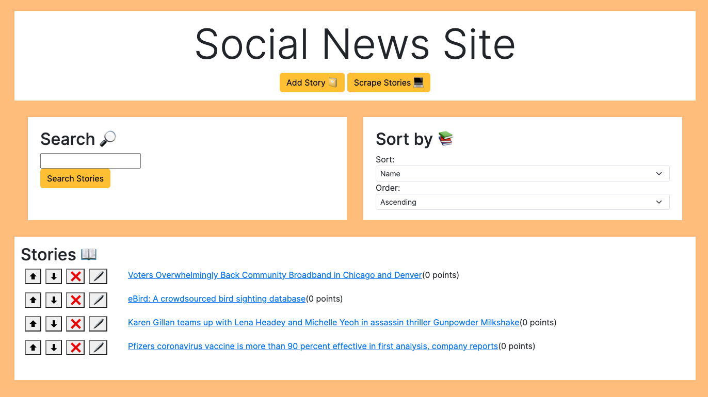

# Social News

## Overview

This repository has an API that is used to power a social news site.

Here's a preview of how it looks:

This frontend is written in vanilla JavaScript and HTML, with some CSS and is delivered from the backend via an endpoint.

You can find the files that deliver our website in the static folder, it can be accessed when the Backend is running.

The requirements.txt folder contains a list of the modules needed to download for the project.

